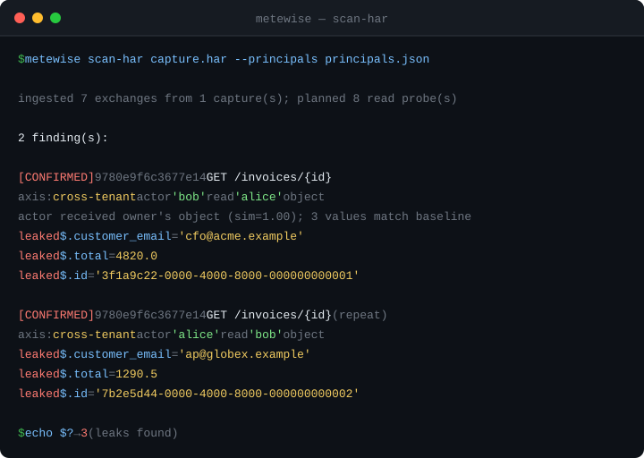

# metewise

**metewise checks whether your website's API lets one user see another user's
private data.**

That bug has a name — **BOLA** (Broken Object Level Authorization), also called
**IDOR** — and it is one of the most common serious flaws in web APIs. metewise
finds it for you, automatically, and *proves* it by showing you the exact data
that leaked.



---

## The problem, in one picture

Imagine a coat check. You hand in your coat and get **ticket #42**. Later you
come back, show #42, and get *your* coat. Good.

Now imagine you show **ticket #43** — someone else's ticket — and the attendant
just hands you their coat without checking it's yours. That's a BOLA bug.

APIs do this constantly. Your app asks for your invoice at:

```
GET /invoices/42
```

If you change `42` to `43` and the server hands you **someone else's invoice**,
that's the same bug — and it's how real companies leak customer data.

**metewise logs in as two different users and tries to grab each other's stuff.
If the server lets it, metewise tells you exactly what leaked.**

---

## See it work in 60 seconds (no setup, no real website needed)

metewise ships with a tiny fake "vulnerable" app so you can watch it catch a
real bug immediately.

**Step 1 — get the code and install it.** (You need Python 3.10 or newer.)

```sh
git clone https://github.com/RaoMK/metewise.git
cd metewise
pip install -e .
```

**Step 2 — start the fake vulnerable app.** Leave this running; open a second
terminal window for the next step.

```sh
python3 fixtures/vuln_app.py 8096
```

**Step 3 — in the second terminal, run metewise against it:**

```sh
cd metewise
metewise scan-har fixtures/capture.har --principals fixtures/principals.json
```

**What you'll see:**

```
ingested 7 exchanges from 1 capture(s); planned 8 read probe(s)

2 finding(s):

  [CONFIRMED] 9780e9f6c3677e14  GET /invoices/{id}
      axis: cross-tenant   actor 'bob' read 'alice' object
      actor received owner's object (sim=1.00); 3 stable leaf value(s) match the victim baseline
        leaked $.total = 4820.0
        leaked $.customer_email = 'cfo@acme.example'
        leaked $.id = '3f1a9c22-...'
```

That's the tool catching Bob reading Alice's invoice — and printing the private
data (`cfo@acme.example`, the `total`) that leaked. It also quietly checked two
*safe* endpoints and correctly did **not** flag them.

That's the whole idea. Now let's point it at a real app.

---

## Using it on your own website / API

You need to give metewise two things:

1. A recording of your app's network traffic (a **HAR file**).
2. A small file that tells it **who your test users are** (`principals.json`).

Then you run one command. Here's each step.

### Step 1 — Record your app's traffic (make a HAR file)

A **HAR file** is just a recording of the requests your browser made. Every
browser can save one:

1. Open your app in Chrome or Firefox and **log in as your first test user**
   (say, "Alice").
2. Press **F12** to open Developer Tools, and click the **Network** tab.
3. Click around your app normally — open your profile, your orders, your
   invoices, etc. The more of *your own* stuff you view, the better.
4. Right-click anywhere in the list of requests →
   **"Save all as HAR with content"**. Save it as `alice.har`.
5. **Log out, log in as a second user** ("Bob"), and repeat → save `bob.har`.

> You want at least two users so metewise has someone to impersonate. Capturing
> each user viewing *their own* data is exactly what it needs — it figures out
> the cross-user attacks by itself.

### Step 2 — Tell metewise who your users are (`principals.json`)

metewise needs to know, for each user, the **header that identifies them** to
your server. This is usually an `Authorization: Bearer ...` token or a session
`Cookie`.

**How to find it:** in the same Network tab, click any request, look at
**Request Headers**, and find the line that proves who you are — commonly:

```
Authorization: Bearer eyJhbGciOi...
```

Create a file called `principals.json` like this:

```json
{
  "alice": {
    "tenant": "acme",
    "headers": { "Authorization": "Bearer ALICE_TOKEN_HERE" }
  },
  "bob": {
    "tenant": "globex",
    "headers": { "Authorization": "Bearer BOB_TOKEN_HERE" }
  }
}
```

- **The name** (`alice`, `bob`) is just a label you pick.
- **`headers`** is the identifying header for that user. metewise uses it for
  *two* things: to recognize which requests in the HAR belong to which user,
  **and** to log in as that user when it runs its tests. So the tokens must be
  **current and valid** — a stale token makes the run untrustworthy (metewise
  will tell you, rather than pretend everything's fine).
- **`tenant`** is optional. If your app has organizations/teams/workspaces, put
  the user's org here. It just makes the report clearer ("cross-tenant" vs.
  "same-tenant"). Leave it out if you're not sure.

> **Cookie instead of a token?** Use the `Cookie` header, e.g.
> `"headers": { "Cookie": "session=abc123" }`. A partial value is fine — metewise
> matches if the header *contains* what you wrote.

### Step 3 — Run it

```sh
metewise scan-har alice.har bob.har --principals principals.json
```

metewise will re-send requests to your API to test them, then print any leaks.

> ⚠️ **Only run this against an app you own or are allowed to test.** metewise
> actively sends requests to the target. Point it at your own staging or test
> environment, not someone else's website.

---

## How to read the results

Each finding looks like this:

```
  [CONFIRMED] 9780e9f6c3677e14  GET /invoices/{id}
      axis: cross-tenant   actor 'bob' read 'alice' object
      leaked $.customer_email = 'cfo@acme.example'
```

Reading it line by line:

| Part | Means |
|---|---|
| `CONFIRMED` | metewise is sure — it saw the victim's actual data come back. `PROBABLE` means "looks like a leak, please double-check." |
| `9780e9f6...` | A stable ID for this finding. It stays the same even as the data changes, so you can track "is this bug fixed yet?" over time. |
| `GET /invoices/{id}` | The vulnerable endpoint. `{id}` is the part that was swapped. |
| `axis: cross-tenant` | The leak crossed between two different organizations (worst case). `intra-tenant` = same org, different user. |
| `actor 'bob' read 'alice' object` | Bob managed to read Alice's data. |
| `leaked $.customer_email = ...` | **The actual private data that leaked.** This is your proof. |

**What if it finds nothing?** You'll see `No object-authorization leaks found.`
That's good — it means every cross-user probe was correctly blocked.

### Exit codes (for automation / CI)

metewise sets an exit code so you can wire it into a pipeline:

| Code | Meaning | What you should do |
|---|---|---|
| `0` | Clean — no leaks | Nothing. |
| `1` | Something was wrong with your command or files | Fix the command / file paths. |
| `2` | **Run invalid** — couldn't be trusted (e.g. a token had expired) | Refresh your tokens in `principals.json` and re-run. Do **not** treat this as "safe". |
| `3` | Leaks found | Read the findings and fix the endpoints. |

---

## Testing writes too (update & delete)

By default metewise only *reads* — it's completely safe. But the scariest BOLA
bugs let another user **change** or **delete** your data, not just see it. metewise
can test for those too, and it's built to do so without wrecking your data:

```sh
# also test PUT/PATCH (reversible — see below)
metewise scan-har alice.har bob.har --principals principals.json --write

# also test DELETE (uses throwaway objects — see below)
metewise scan-har alice.har bob.har --principals principals.json --allow-destructive
```

**How it stays safe:**

- **Updates (`--write`)** — before letting the "attacker" change an object,
  metewise takes a snapshot of it as the real owner, writes a clearly-marked
  test value (`metewise-canary-...`), checks whether it stuck, then **puts the
  original value back** and verifies the restore. If a restore ever fails, it
  says so loudly.
- **Deletes (`--allow-destructive`)** — metewise **never deletes your real
  data**. It first *creates a brand-new throwaway object* (by replaying a
  "create" request it saw in your capture), then tries to delete *that* as the
  wrong user. Your real objects are never the target.
- **Dangerous endpoints are never touched.** Anything that looks like it moves
  money or sends messages — `/pay`, `/charge`, `/refund`, `/email`, `/sms`,
  `/webhook`, and similar — is automatically skipped, always.

Still: run write tests against a **staging/test environment**, not production.

## Frequently asked questions

**Do I need to know how to code?**
No. If you can install Python, save a file, and copy-paste a command, you can
use metewise.

**Will it break or delete anything in my app?**
Not by default — with no extra flags it only *reads* (GET requests). If you opt
in to write testing, updates are snapshotted and restored, deletes only ever hit
throwaway objects metewise created itself, and money/message endpoints are always
skipped. See [Testing writes too](#testing-writes-too-update--delete). Even so,
point write tests at staging, not production.

**It printed "RUN INVALID". What now?**
One of your tokens probably expired. Recording the HAR and getting fresh tokens,
then updating `principals.json`, fixes it. metewise refuses to say "all clear"
when it can't trust the run — that's on purpose.

**It says "planned 0 probes."**
metewise couldn't find any object IDs to test. Make sure your HAR captures
requests where the user views *their own things* (invoices, orders, profile),
and that both users are actually logged in during their recordings.

**Can I test more than two users?**
Yes — add as many as you like to `principals.json` and pass as many HAR files as
you like. metewise automatically tries every user against every other user's
objects.

---

## Why metewise instead of other tools

Swapping one user's cookie for another's is an old trick (Burp's Autorize, Auth
Analyzer, AuthMatrix). The hard part isn't *doing* the swap — it's telling a
**real leak** apart from **noise**. That's what metewise is built around:

| A common trap | How metewise avoids it |
|---|---|
| Server replies `200 OK` but with `{"error":"forbidden"}` — looks like a bypass | It compares the *shape* of the reply against a known "denied" reply, so a polite refusal isn't mistaken for a leak. |
| Some data is public on purpose and looks "leaked" to everyone | It also asks as a **logged-out** user; if the public gets it too, it's not a leak. |
| "Bypassed! (size differs by 1420 bytes)" tells you nothing | It proves the leak by matching the **victim's actual values**, and prints them. |
| An expired token silently turns every test into a false "all clear" | It notices the owner can't read their *own* data and marks the whole run **invalid**. |
| Findings keep changing as IDs rotate | Each finding gets a **stable fingerprint**, so CI can flag only *new* bugs. |

---

## How it works under the hood (optional reading)

For each attempt — user **B** trying to open an object owned by user **A** —
metewise gathers up to four reference responses and compares the suspicious one
against them:

```
                 A's object       B's own object    nonexistent      logged-out
   as owner A    baseline (x2)        —                 —                —
   as actor B    THE PROBE         allow-control     deny-control    public-check
```

The verdict is a *classification* of the probe against those references:

- looks like the **logged-out** reply got the object → public, **not** a leak
- looks like the **denied** reply → access correctly refused
- looks like the real **object** *and* carries A's actual values → **CONFIRMED leak**
- looks like an object but nothing distinctive matched → **PROBABLE leak**
- looks like none of them → **UNKNOWN** (a human should look)

The pipeline that gets there: read the HAR → figure out which request belongs to
which user → find the values the API handed back (those are the object IDs worth
testing) → rewrite URLs into templates like `/invoices/{id}` → work out who owns
each object → try every object as every *other* user.

**Writes are judged by effect, not by response.** A successful unauthorized
`DELETE` just returns `204` — the damage only shows when the owner looks again.
So for a write, metewise performs the action as the attacker and then checks, *as
the owner*, whether the object actually changed or vanished. That check is the
proof, which is why write findings are effect-verified, and why updates can be
snapshotted and restored and deletes can be aimed at seeded throwaways.

---

## Running the tests (for contributors)

```sh
python3 -m unittest discover -s tests -v
```

The suite stands up the fake app and checks all four behaviours: a real leak is
confirmed *with evidence*, a polite `200`-forbidden is treated as a denial, a
public resource isn't flagged, and an expired owner token yields INVALID.

---

## What v1 can and can't do

**Can:** REST + JSON APIs, read-side object leaks (GET), **write-side leaks
(PUT/PATCH/DELETE) with snapshot-restore and throwaway seeding**, cross-tenant
and intra-tenant, header/cookie/token auth, multiple users and multiple captures.

**Accuracy:** metewise ships a [benchmark harness](benchmark/) that scores it
against targets with known bugs. On the bundled fixture it currently gets
**100% precision and 100% recall** (3/3 planted bugs, 0 false positives), and
that check runs in CI so accuracy can't silently regress.

**Can't yet (on the roadmap):**

- [ ] GraphQL / gRPC, and login/SSO flows (for now, paste current tokens)
- [ ] Published precision/recall against the Dockerised OWASP apps (crAPI,
      VAmPI) — the harness is ready; the numbers await a run on a Docker host

---

## Safety and permission

Only run metewise against systems **you own or are explicitly authorised to
test**. It sends real requests to the target. Testing someone else's system
without permission may be illegal.

## License

MIT — see [LICENSE](LICENSE).
